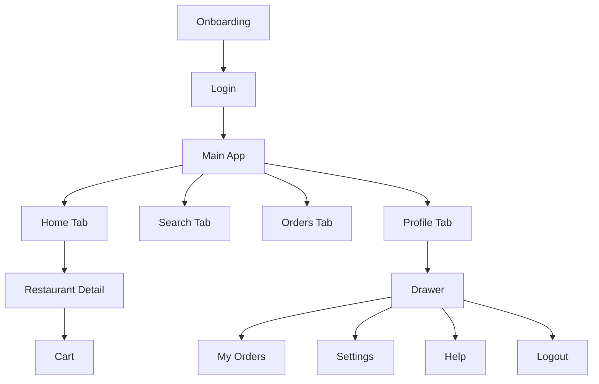

# Reactive Food Delivery

Food delivery demo app built with Expo and React Native. The project is focused on React Navigation patterns: onboarding, conditional auth, nested stacks, tabs, drawer navigation, params, deep links, and state persistence.

## Navigation Structure

## Flow Notes

The app uses a root stack to switch between the auth flow and the main app. The Home tab nests a restaurant stack so restaurant detail and cart can hide the tab bar. The Profile tab hosts a drawer navigator with custom content, and the app persists mock auth, onboarding, and cart state with AsyncStorage.

## Deep Link

`foodapp://restaurant/123` opens the restaurant detail screen for the matching restaurant id.