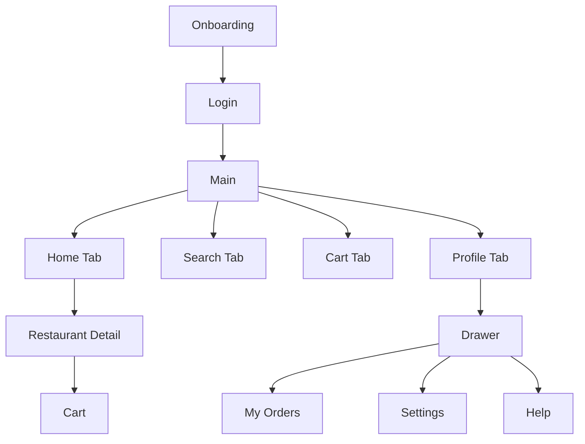

# Reactive Food Delivery

Food delivery demo app built with Expo and React Native. The project is focused on React Navigation patterns: onboarding, conditional auth, nested stacks, tabs, drawer navigation, params, deep links, and state persistence.
## **Project Overview**

Reactive Food Delivery is a demo food delivery app built with Expo + React Native. It demonstrates common navigation patterns (onboarding, auth gating, nested stacks, bottom tabs, and drawer), state persistence via AsyncStorage, deep links, and localization of prices for India (INR formatting).

## **Tech Stack**

- **Platform**: Expo (React Native)
- **Navigation**: React Navigation (native stack, bottom tabs, drawer)
- **State & Persistence**: Context API + AsyncStorage (`@react-native-async-storage/async-storage`)
- **Language**: TypeScript
- **UI**: React Native core, `@expo/vector-icons`, `expo-status-bar`

## **How to run locally**

- Install dependencies:

```bash
npm install
```

- Start Expo (clear cache recommended):

```bash
expo start -c
```

- Open on a device or simulator via Expo Go or the simulator links shown by the Expo devtools.

Notes:
- Run `npx tsc --noEmit` to type-check the project.

## **Navigation Structure**

The app uses a root stack that switches between Auth and Main. The Main app is a bottom-tab navigator with nested stacks/drawers:



- See navigation code in [src/navigation/RootNavigator.tsx](src/navigation/RootNavigator.tsx#L1), [src/navigation/MainTabsNavigator.tsx](src/navigation/MainTabsNavigator.tsx#L1), and [src/navigation/HomeStackNavigator.tsx](src/navigation/HomeStackNavigator.tsx#L1).

## **Deep linking setup**

- Example deep link: `foodapp://restaurant/123` opens the Restaurant Detail screen when the `restaurantId` matches.
- Deep link handling is wired in the root navigation logic and the app manifest: see [src/navigation/RootNavigator.tsx](src/navigation/RootNavigator.tsx#L1) and [app.json](app.json#L1).

## **Screens & Quick Walkthrough**

- **Onboarding** → **Login** → **Home** (tabs)
- **Home**: browse restaurants, search, profile avatar in header
- **Restaurant Detail**: shows image, description, price in ₹, ETA; supports adding to cart and quantity controls
- **Cart**: view items, totals in INR, place order (demo flow clears cart and shows confirmation)
- **Profile Drawer**: avatar, My Orders, Settings, Help, Logout

## **Screenshots (optional)**

- Add screenshots to `assets/screenshots/` and reference them here for visual documentation.

## **Assumptions & Notes**

- This is a demo app — authentication is mocked and persisted via AsyncStorage for development. Dev behavior clears stored state on localhost to show onboarding repeatedly.
- Prices are formatted for India using `toLocaleString('en-IN')` and displayed with the `₹` symbol.
- Deep link example expects a `restaurantId` that exists in `src/data/restaurants.ts`.
- The Orders tab was replaced with a Cart tab in the bottom navigation; historical or drawer-based order lists remain available under Profile → My Orders.

### App reload with persisted auth state

- The app persists auth, onboarding, and cart state in AsyncStorage and restores them on app reload. If a user is signed in, the app will restore the authenticated state and land in the main app instead of the auth flow. See [src/state/AppStateContext.tsx](src/state/AppStateContext.tsx#L1) for persistence and hydration logic.
- For development, the code clears stored state when running against localhost so the onboarding can be shown repeatedly; this behavior is intentional for local testing.

## **Files to inspect**

- App entry: [App.tsx](App.tsx#L1)
- Root navigation: [src/navigation/RootNavigator.tsx](src/navigation/RootNavigator.tsx#L1)
- Main tabs: [src/navigation/MainTabsNavigator.tsx](src/navigation/MainTabsNavigator.tsx#L1)
- Home stack & detail: [src/navigation/HomeStackNavigator.tsx](src/navigation/HomeStackNavigator.tsx#L1) and [src/screens/RestaurantDetailScreen.tsx](src/screens/RestaurantDetailScreen.tsx#L1)
- App state & persistence: [src/state/AppStateContext.tsx](src/state/AppStateContext.tsx#L1)

If you want, I can add example screenshots and a short demo GIF to `assets/screenshots/` and update this README with image previews.